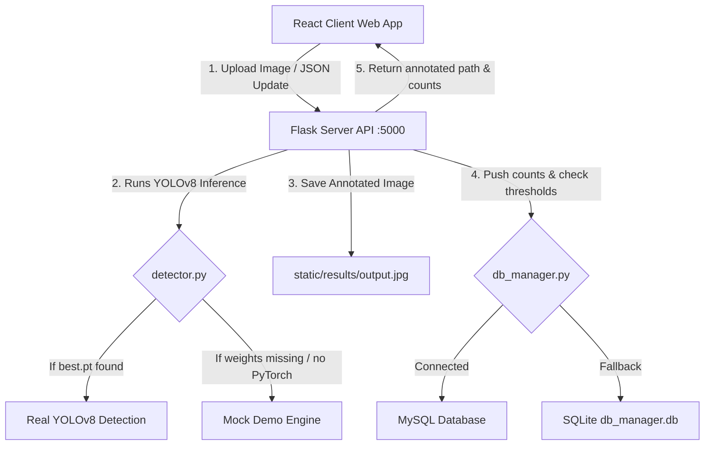

# VisionVend – Setup and Deployment Guide

VisionVend is a modern SaaS-style AI-based product recognition and shelf inventory monitoring system. It uses **YOLOv8** for computer vision detections, a **Flask REST API** backend, and a **React (Vite) + Tailwind CSS** dashboard frontend, backed by **MySQL** (with automated fallback support).

---

## System Architecture Overview



---

## 🛠️ Step-by-Step Installation

### Prerequisites
- **Python 3.8 - 3.11** installed.
- **Node.js (LTS)** and `npm` installed.
- **MySQL Server** installed and running (optional, system falls back to SQLite automatically if offline).

---

### 1. Database Configuration (MySQL)
1. Start your local MySQL instance (e.g., via XAMPP, Docker, or native installer).
2. Log into the MySQL terminal or client (like phpMyAdmin or DBeaver) and run the setup script located at `backend/database/schema.sql`:
   ```sql
   CREATE DATABASE IF NOT EXISTS visionvend;
   USE visionvend;
   -- Runs the schema tables setup
   ```

---

### 2. Backend API Setup
1. Open a terminal and navigate to the backend folder:
   ```bash
   cd backend
   ```
2. Create a Python Virtual Environment:
   ```bash
   python -m venv venv
   ```
3. Activate the virtual environment:
   * **Windows Powershell**: `.\venv\Scripts\Activate.ps1`
   * **Windows Command Prompt**: `.\venv\Scripts\activate.bat`
   * **macOS/Linux**: `source venv/bin/activate`
4. Install all python dependencies:
   ```bash
   pip install -r requirements.txt
   ```
5. Configure Environment Variables:
   Create a `.env` file from the example:
   ```bash
   copy .env.example .env
   ```
   Modify database configuration details in `.env` to match your local setup:
   ```env
   PORT=5000
   DB_HOST=localhost
   DB_USER=root
   DB_PASSWORD=your_mysql_password
   DB_NAME=visionvend
   ```
6. **Deploy YOLOv8 Model**:
   Place your trained `best.pt` file inside the `backend/yolov8/` folder (overwrite the folder placeholder).
7. Start the Flask server:
   ```bash
   python app.py
   ```
   *The server runs at `http://localhost:5000`.*

---

### 3. Frontend Dashboard Setup
1. Open a new terminal and navigate to the frontend folder:
   ```bash
   cd frontend
   ```
2. Install npm packages:
   ```bash
   npm install
   ```
3. Start the Vite React development server:
   ```bash
   npm run dev
   ```
4. Open your browser to the local hosting URL (usually `http://localhost:5173`).

---

## 💡 Developer Information

### 1. Zero-Install Fallback Mode (Demo Engine)
To allow immediate deployment and demonstration without setting up a machine learning pipeline or database engine:
- **Missing `best.pt` / PyTorch**: The backend defaults to a simulated computer vision detector. When you upload any image on `/detect`, it draws realistic boxes for typical store items (Coke, Pepsi, water bottles, Lays) and outputs classification arrays.
- **MySQL Connection Failure**: The database subsystem automatically creates a local file database at `backend/database/fallback_visionvend.db` using Python's native `sqlite3` driver. It pre-populates it with mockup stocks to render dashboards out-of-the-box.
- Once you start MySQL and place the weights file, it automatically upgrades to standard operations.

### 2. File Download Feature
The **AI Detection** page contains an **Export Report (CSV)** button. This extracts the product counts and confidence ratios directly into a clean spreadsheet download.
